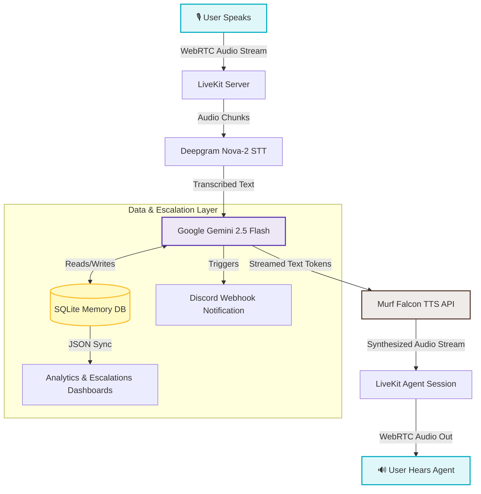

# Aarogya Saathi: How I Built a Multi-Agent Voice AI Assistant for Rural Indian Healthcare


Connecting rural and semi-urban India ("Bharat") to modern healthcare services is one of the most critical challenges of our time. Traditional digital solutions like websites and apps often fail because of literacy barriers, complex user interfaces, and lack of localized dialect support. 

For the **Voice for Bharat Challenge 2026** organized by **Murf AI**, I built **Aarogya Saathi (आरोग्य साथी)**—a production-grade, bilingual voice assistant designed to bridge this accessibility gap. Aarogya Saathi allows users to speak naturally in everyday **Hinglish** (a blend of Hindi and English) to check health symptoms, qualify for government schemes, locate nearby clinics, and seamlessly book appointments.

Here is the story of how I built it, the architecture that powers it, and the technical lessons learned along the way.

---

## 1. The Core Architecture: Low-Latency Voice Pipeline

A voice assistant must feel like a natural telephone conversation. If the latency between a user finishing their sentence and the agent speaking exceeds 1 second, the illusion of human interaction breaks.

To achieve a natural conversational flow, Aarogya Saathi uses a highly optimized real-time stream:



### Technology Stack
*   **Audio Transport**: [LiveKit](https://docs.livekit.io/) (WebRTC real-time transport for ultra-low latency audio streaming).
*   **Speech-to-Text (STT)**: Deepgram Nova-2 (Bilingual model customized for Indian accents and mixed languages).
*   **Large Language Model (LLM)**: Google Gemini 2.5 Flash (extremely fast response times and reasoning).
*   **Text-to-Speech (TTS)**: **Murf Falcon** (the fastest TTS model on the market, achieving a record-breaking **55ms model latency** and **130ms time-to-first-audio**).
*   **Backend Framework**: Python (LiveKit Agents SDK) + SQLite3.
*   **Frontend**: Next.js App Router (React, Tailwind CSS, and Server Actions).

---

## 2. Key Features Built

Over the challenge, I expanded Aarogya Saathi from a simple greeting bot into a multi-agent system. Here are the core features:

### A. Natural Hinglish & Murf Falcon TTS
Rural users speak a mixture of Hindi and English. Aarogya Saathi's system prompts are designed to instruct the LLM to output responses in native **Devanagari script for Hindi** while keeping everyday medical words like *doctor*, *fever*, *tablet*, and *BP* in **English** (e.g., `"लगता है हल्का fever है, थोड़ा rest कीजिए"`).
*   **Pooja** (the main assistant) uses a warm, female Murf Falcon voice (`hi-IN` locale, `Conversational` style, `48000Hz` sample rate).
*   Writing the Hindi parts in Devanagari prevents the synthesizer from reading transliterated text with an unnatural foreign accent, giving it an authentic Indian personality.

### B. Consent-Gated Long-Term Memory (SQLite)
A critical rule for the Health Access track is **data privacy**. The agent must never save patient information without explicit consent, and it must never store sensitive data like Aadhaar or bank numbers.
*   **Recall on Connect**: As soon as the caller states their name, the agent silently calls `recall_caller(name)` to fetch their profile and greet them back dynamically (e.g., *"अरे सीता जी, फिर से नमस्ते! पिछली बार BP की बात हुई थी, अब कैसा लग रहा है?"*).
*   **Consent Gating**: The agent explicitly asks: *"क्या मैं आपकी ये जानकारी याद रख लूँ, ताकि अगली बार दोबारा न बतानी पड़े?"*. It only calls `remember_caller` if the user gives a clear "Yes".
*   **Privacy compliance**: It includes a `forget_caller()` tool to delete user records instantly on request.

### C. Live Location PIN Geocoding & Health Directory Lookup
If a user asks for the nearest doctor or Primary Health Center (PHC), the agent prompts them for their 6-digit postal PIN code.
*   The agent calls `lookup_nearest_facility(pincode)`.
*   This tool queries the live **Postal Pincode API** to geocode the PIN code and determine the district/block.
*   It then searches a local directory database containing public health facilities across major states (UP, Bihar, Jharkhand, MP, Maharashtra, Rajasthan) and reads out the exact facility and contact details from the *August 2026 health directory*.

### D. Triage severity classifier & Scheme Eligibility
*   **Symptom Classifier**: The agent uses the `classify_triage_level` tool to evaluate symptoms and categorize them into **RED** (immediate emergency/108 call), **YELLOW** (PHC visit within 24-48 hours), or **GREEN** (home care/rest).
*   **Maternity & Scheme eligibility**: Built eligibility calculators for **Ayushman Bharat** (checking rural deprivation indices) and **PM Matru Vandana Yojana** (maternity cash benefits).

### E. Bidirectional Multi-Agent Handoff
To keep the main assistant focused on health guidance, I created a second agent: **Abhinav** (Clinic and Appointment Specialist), represented by a distinct male Murf Falcon voice.
*   When a user asks to book a slot (e.g., *"मुझे रामपुर PHC में अपॉइंटमेंट बुक करना है"*), Pooja calls `transfer_to_appointments` to hand the session over to Abhinav.
*   Abhinav collects booking details (patient name, facility, date, slot) and calls `book_appointment` to generate an ID like `APT-7843`.
*   If the user asks a medical question during the booking (e.g., *"मुझे बहुत बुखार है, क्या दवा लूं?"*), Abhinav calls `transfer_to_main` to transfer them back to Pooja.
*   **Conversation context (`chat_ctx`) is fully copied and preserved** across both agents so the user never has to repeat themselves.

```python
@function_tool
async def transfer_to_appointments(self, context: RunContext) -> tuple[Agent, str]:
    """Transfer the user to the clinic and appointment specialist."""
    logger.info("Transferring to appointment specialist")
    chat_ctx = self.chat_ctx.copy(exclude_instructions=True)
    chat_ctx.add_message(
        role="system",
        content="[SYSTEM: The user has been transferred to you (Abhinav, the appointment specialist)...]"
    )
    appointment_agent = AppointmentAgent(chat_ctx=chat_ctx, ctx=self.ctx)
    return appointment_agent, "ठीक है, मैं आपको क्लिनिक और अपॉइंटमेंट स्पेशलिस्ट के पास ट्रांसफर कर रही हूँ।"
```

### F. Outbound Telephony & Web Dashboards
*   **SIP Integration**: Implemented outbound phone dialing using LiveKit's SIP participant service (`create_sip_participant`) so the agent can ring real numbers (tested via Linphone softphone client) with the `end_call()` tool allowing the agent to programmatically hang up.
*   **Escalations Dashboard (`/escalations`)**: A web panel listing all human referrals with emergency filters, real-time Discord webhook triggers, and "Resolve/Re-open" actions.
*   **Analytics Dashboard (`/analytics`)**: Tracks call success, failure, duration, and user engagement metrics synced from SQLite.

---

## 3. Key Challenges and How I Solved Them

Building voice agents is a battle against physics and conversational nuances. Here are the two biggest challenges I faced:

### Challenge 1: Voice Activity Detection (VAD) Tuning for Hinglish
Standard Silero VAD is trained on English speakers who talk continuously. Hinglish speakers often pause momentarily to think of the English equivalent of a word, or they pause mid-sentence during code-mixed speech. Initially, the agent would cut the user off prematurely.
*   **Solution**: I increased the VAD silence detection threshold and adjusted the agent's turn-detector settings. By configuring the `blingfire` sentence tokenizer and adding a minor breathing room delay, the agent only responds when the user has genuinely completed their thought.

### Challenge 2: Context Sync in LiveKit Handoffs
During handoffs, the conversation context must transfer seamlessly between Pooja (the main assistant) and Abhinav (the appointment specialist). In early prototypes, returning to the main assistant wiped out the previous discussion memory.
*   **Solution**: I resolved this by copying the `chat_ctx` manually but excluding the agent's system prompt instructions. I appended a clean `[SYSTEM: ...]` context boundary message during transfer to let the target agent know where the user came from, enabling Pooja to say: *"Welcome back, I see you booked your appointment. Let's discuss your fever now."*

---

## 4. How to Run Aarogya Saathi Locally

Want to test the voice agent yourself? Follow these simple steps:

### Step 1: Clone and Install
1.  **Clone the codebase**:
    ```bash
    git clone https://github.com/sonu9699/murf-livekit-starter.git
    cd murf-livekit-starter
    ```
2.  **Install backend dependencies (Python 3.10+ and uv)**:
    ```bash
    cd backend
    uv sync
    uv run python src/agent.py download-files
    ```
3.  **Install frontend dependencies**:
    ```bash
    cd ../frontend
    pnpm install
    ```

### Step 2: Set Environment Variables
Create a `.env.local` file inside the `backend/` and `frontend/` folders. Fill in your API keys:
```env
LIVEKIT_URL=wss://<your-livekit-project>.livekit.cloud
LIVEKIT_API_KEY=your_livekit_api_key
LIVEKIT_API_SECRET=your_livekit_api_secret
MURF_API_KEY=your_murf_api_key
DEEPGRAM_API_KEY=your_deepgram_api_key
GOOGLE_API_KEY=your_gemini_api_key
```

### Step 3: Run the Application
You can start both the Next.js frontend and the Python LiveKit Agent using the helper script in the root directory:
```bash
./start_app.sh
```
Open `http://localhost:3000` in your browser, allow microphone access, and click **"Baat shuru karein"** (Start call) to talk to Aarogya Saathi.

To run the automated test suite (which validates all memory, geocoding API, and handoff flows):
```bash
cd backend
uv run pytest
```

---

## 5. What's Next for Aarogya Saathi?

If I were to take this agent to the next level:
1.  **Asha Worker Companion App**: Direct integration into WhatsApp Voice notes so rural health workers can submit audio reports and receive automated triaging.
2.  **Offline Models**: Running lighter bilingual models locally on edge servers in remote PHCs to ensure 100% uptime even when the internet goes down.
3.  **Regional Accent Adaptability**: Expanding TTS locales to support localized dialects like Bhojpuri, Haryanvi, and Marwari.

Building Aarogya Saathi has shown me that voice AI is not just a luxury—it is a vital bridge to digital inclusion. Special thanks to the **Murf AI** team for hosting this challenge!

***

*Link to project repository*: [Aarogya Saathi GitHub Repo](https://github.com/sonu9699/murf-livekit-starter)

#VoiceForBharat #10DaysOfVoiceAgents #VoiceAI #MurfAI
