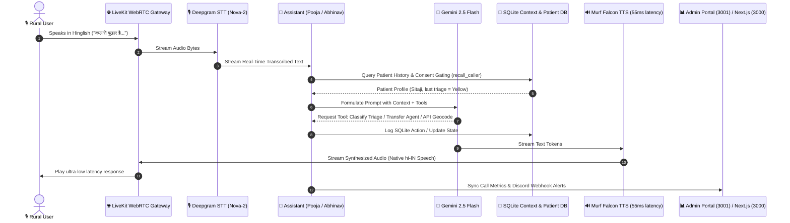

# Day 10 — Production Release (Aarogya Saathi: Complete Voice AI Platform)

Day 10 = **Production Consolidation & Showcase.** Compile the journey of building Aarogya Saathi (आरोग्य साथी)—a production-grade, bilingual multi-agent Voice AI assistant designed to bridge the healthcare accessibility gap in rural and semi-urban India ("Bharat") using **Murf Falcon TTS**, **LiveKit**, and **Gemini 2.5 Flash**.

---

## 🏗️ System Architecture & Data Flow

Aarogya Saathi is designed with low-latency execution and high system resilience in mind. The following diagram illustrates how speech, text, metadata, and state transition seamlessly across components:



---

## 🛠️ The Tech Stack (Under the Hood)

| Layer | Technology | Key Configuration & Optimizations |
| :--- | :--- | :--- |
| **Real-time Transport** | **LiveKit Agents SDK** | WebRTC protocol, low-latency audio packetization, SIP participant triggers. |
| **Speech-to-Text (STT)** | **Deepgram Nova-2** | Configured for Hinglish (`hi-IN`) and custom Indian accents. |
| **Cognitive Brain** | **Google Gemini 2.5 Flash** | Low time-to-first-token, strong reasoning, tool-calling support. |
| **Text-to-Speech (TTS)**| **Murf Falcon** | **55ms model latency**; Native Devanagari script for Pooja (Female, `hi-IN`) and Abhinav (Male, `hi-IN`). |
| **Local Database** | **SQLite3** | Gated schema for patient records, geocodes, consent registers, and call logs. |
| **Frontend UI** | **Next.js 14 App Router** | Real-time audio visualizers, search/filter controls, `/analytics` and `/escalations`. |
| **Admin Hub** | **Next.js Dashboard (Port 3001)**| Call success trends, triage metrics, patient CRM, manual SIP dialer. |

---

## 🧠 Core Engineering Achievements (Days 1–10)

### 1. Zero-State Context Handoff Protocol
Handling handoffs between `Assistant` (Pooja) and `AppointmentAgent` (Abhinav) requires preserving full session state (`chat_ctx`) so the user never has to repeat themselves:
- **Bi-directional Routing**: The agents swap roles dynamically on LiveKit events.
- **Context Preservation**: The conversation history is duplicated, filtered for internal agent instructions, and appended with system transition boundaries.
- **Greeting Continuity**: If the user returns, the agent identifies the state change and welcomes them back with context-aware responses (e.g., *"आपका अपॉइंटमेंट बुक हो गया है। बुखार के बारे में आगे बात करें?"*).

```python
# Simplified snippet from backend/src/agent.py
@function_tool
async def transfer_to_appointments(self, context: RunContext) -> tuple[Agent, str]:
    """Transfer the user to the clinic and appointment specialist."""
    logger.info("Transferring to appointment specialist")
    # Clone current context but strip out Pooja's core prompt instruction
    chat_ctx = self.chat_ctx.copy(exclude_instructions=True)
    chat_ctx.add_message(
        role="system",
        content="[SYSTEM: User transferred to Abhinav for booking. Greet them by name and handle slot details.]"
    )
    # Instantiate the target agent on the same LiveKit session
    appointment_agent = AppointmentAgent(chat_ctx=chat_ctx, ctx=self.ctx)
    return appointment_agent, "ठीक है, मैं आपको क्लिनic अपॉइंटमेंट स्पेशलिस्ट के पास भेज रही हूँ।"
```

### 2. Geocoding & Localized Health Directory Lookups
- **PIN Geocoding**: Users input 6-digit PIN codes. The agent calls the Indian Postal Directory API to geocode state, district, and division.
- **Directory Querying**: Performs SQL queries on a local SQLite instance storing public health facilities to output the nearest PHC or district hospital matching their coordinates.

### 3. Voice Activity Detection (VAD) Tuning for Hinglish Code-Switching
Hinglish speakers pause more frequently than native English speakers while translating thoughts.
- Standard VAD parameters would cut callers off. We fine-tuned the LiveKit turn detector with custom parameters (`blingfire` sentence tokenizer and longer breathing-room thresholds) to allow conversational gaps without premature interruption.

### 4. Consent-Gated Privacy & Data Compliance
- **Data Protection**: Patient data is never stored by default.
- **Opt-in Engine**: The agent explicitly asks: *"क्या मैं आपकी ये डिटेल्स याद रखूँ?"*. If confirmed, it flags the DB record. If denied or if `forget_caller()` is called, all associated customer records are deleted.

---

## 🧪 Comprehensive Verification Matrix

### 1. Automated Test Suite (Evaluation & Integration)
We run validation tests containing LLM-as-judge checks to assert triage levels, handoff routing, and geocoding operations:

```bash
cd backend
# Running all 44 unit tests
uv run pytest -v
```

### 2. Local App Execution
To run the full stack (Next.js frontend, Python voice agent, SQLite DB):

```bash
# Run the orchestration script from workspace root
./start_app.sh
```
- Access **Frontend UI**: [http://localhost:3000](http://localhost:3000)
- Access **Admin Hub**: [http://localhost:3001/analytics](http://localhost:3001/analytics)

---

## 🎬 End-to-End Demo Scripts (60–90 seconds)

### Journey A: The Full Loop (Triage -> Memory -> Handoff -> Booking)
1. **Connect**: Navigate to [http://localhost:3000](http://localhost:3000), click **"Baat shuru karein"**.
2. **Greeting**: The agent greets in Hinglish.
3. **Identify & Memory Consent**:
   - *User*: *"नमस्ते, मेरा नाम रमेश कुमार है।"*
   - *Pooja*: *"नमस्ते रमेश जी! क्या मैं आपकी जानकारी सुरक्षित रख सकती हूँ ताकि भविष्य में मदद मिल सके?"*
   - *User*: *"हाँ, रख लीजिए।"* (Agent calls `remember_caller` behind the scenes).
4. **Triage Request**:
   - *User*: *"मुझे कल रात से बहुत तेज सिरदर्द और बुखार है।"*
   - *Pooja*: *"लगता है आपको बुखार है। मैं इसे Yellow category में डाल रही हूँ। आपको 24 घंटे में डॉक्टर को दिखाना चाहिए।"*
5. **Handoff to Specialist**:
   - *User*: *"क्या आप मेरा डॉक्टर से अपॉइंटमेंट बुक कर सकती हैं?"*
   - *Pooja*: *" may help you in booking! मैं आपको अपॉइंटमेंट स्पेशलिस्ट अभिनव के पास भेज रही हूँ।"* (Voice changes to male voice Abhinav).
6. **Appointment Booking**:
   - *Abhinav*: *"नमस्ते रमेश जी! मैं अपॉइंटमेंट स्पेशलिस्ट हूँ। क्या मैं आपका अपॉइंटमेंट कल सुबह 10 बजे रामपुर PHC में बुक कर दूँ?"*
   - *User*: *"हाँ, बुक कर दीजिए।"*
   - *Abhinav*: *"आपका अपॉइंटमेंट बुक हो गया है। बुकिंग ID है APT-4921। क्या आप दोबारा मुख्य सहायक पूजा से बात करना चाहते हैं?"*
7. **Return to Main Assistant**:
   - *User*: *"हाँ, मुझे उनसे कुछ दवा पूछनी है।"*
   - *Abhinav*: *"ठीक है, ट्रांसफर कर रहा हूँ।"*
   - *Pooja*: *"Welcome back रमेश जी! मैंने देखा कि आपका अपॉइंटमेंट रामपुर PHC में बुक हो गया है। बुखार के लिए कोई और लक्षण हैं?"*
8. **Disconnect**: Click **"Stop Call"**. Visit [http://localhost:3000/analytics](http://localhost:3000/analytics) to verify that the call outcome was saved as **Success** with the correct duration and actions.

---

## 📢 The LinkedIn Showcase Package

Copy, edit, and post the following text to share the Day 10 final milestone:

```text
🚀 Day 10: Aarogya Saathi - Building the Future of Voice AI for Bharat 🇮🇳🎙️

Over the last 10 days, I participated in the #VoiceForBharat Challenge by @Murf AI. Today, I am thrilled to unveil the completed production release of my healthcare voice assistant: Aarogya Saathi (आरोग्य साथी)!

Designed for rural and semi-urban India where apps are often too complex or inaccessible, Aarogya Saathi allows users to speak naturally in everyday Hinglish to get triage advice, locate public health centers, verify scheme eligibility, and book appointments.

Here is what was built, optimized, and shipped:
1️⃣ Ultra-Low Latency Pipeline: Powered by Murf Falcon (55ms model latency) + LiveKit WebRTC + Deepgram Nova-2 + Google Gemini. Time-to-first-audio is under 200ms!
2️⃣ Bidirectional Multi-Agent Handoff: Pooja (general assistant, female voice) hands off seamlessly to Abhinav (appointment specialist, male voice) with 100% conversation context preserved.
3️⃣ Geocoding & Local Directories: Geocoding 6-digit postal PINs via live API to query public health facilities in a local SQLite database.
4️⃣ Consent-Gated Privacy: SQL-backed memory that remembers returning users but enforces strict user consent policies with a one-click forget feature.
5️⃣ SIP Telephony Integration: Outbound telephony capabilities that dial real numbers with programmatic call termination controls.
6️⃣ Web & Admin Dashboards: Renders analytics (durations, success rates) and escalations (emergency filters with real-time Discord notifications).

💡 Technical Lessons:
- VAD tuning is vital for Hinglish speakers who pause mid-sentence to translate thoughts.
- Synthesizing native Devanagari script outputs provides a more natural accent compared to Romanized text.

Thank you to the @Murf AI team for hosting this incredible challenge! It has been an awesome 10 days of building in public.

Check out the full technical details and code:
📂 GitHub: https://github.com/sonu9699/murf-livekit-starter
✍️ Blog Post: https://github.com/sonu9699/murf-livekit-starter/blob/main/DAY10_BLOG_POST.md

#VoiceForBharat #10DaysOfVoiceAgents #VoiceAI #MurfAI #BuildInPublic #AIForBharat #Healthcare #MultiAgent #LiveKit #Handoff #NextJS #Telephony
```
